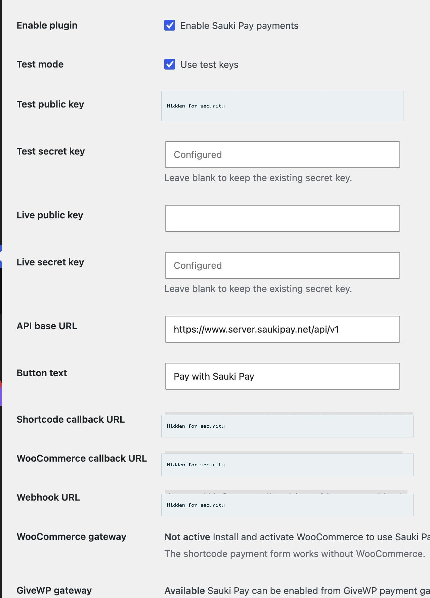
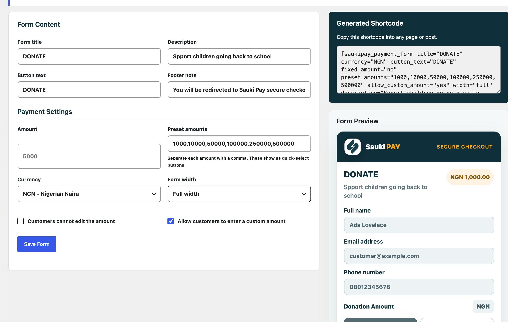
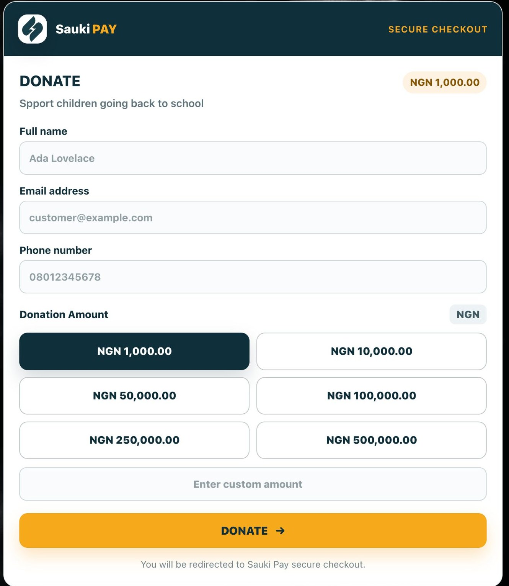

# Sauki Pay WordPress Plugin Guide

Version: 1.1.6

## What This Plugin Does

Sauki Pay helps you accept payments on your WordPress website.

You can use it in three ways:

1. Add Sauki Pay to WooCommerce checkout.
2. Add Sauki Pay to GiveWP donation forms.
3. Add a standalone Sauki Pay payment form to any page with a shortcode.

The plugin connects securely to the Sauki Pay API and redirects customers or donors to Sauki Pay checkout to complete payment.

## Requirements

- WordPress 5.8 or newer.
- PHP 7.4 or newer.
- Sauki Pay merchant public and secret keys.
- WooCommerce, only if you want WooCommerce checkout payments.
- GiveWP, only if you want GiveWP donation payments.

## Download The Plugin

You can download the Sauki Pay WordPress plugin from the official GitHub release page:

`https://github.com/SAUKI-RESOURCE-LTD/SAUKIPAY-WORDPRESS-PLUGIN/releases/tag/v1.1.6`

Direct plugin ZIP download:

`https://github.com/SAUKI-RESOURCE-LTD/SAUKIPAY-WORDPRESS-PLUGIN/releases/download/v1.1.6/saukipay-wordpress-plugin-v1.1.6.zip`

Download the ZIP file before installing the plugin in WordPress.

## Install The Plugin

1. Log in to your WordPress admin dashboard.
2. Go to Plugins > Add New > Upload Plugin.
3. Upload the Sauki Pay plugin ZIP file.
4. Click Install Now.
5. Click Activate Plugin.

After activation, a Sauki Pay menu appears in your WordPress admin sidebar.

## Configure Sauki Pay

1. Open Sauki Pay from the WordPress admin menu.
2. Enable the plugin.
3. Choose test mode or live mode.
4. Enter your Sauki Pay public and secret keys.
5. Confirm the API base URL.
6. Save your settings.

The default API base URL is:

`https://www.server.saukipay.net/api/v1`

Use test mode while setting up and switch to live mode only when you are ready to accept real payments.

## Callback And Webhook URLs

The settings page displays the URLs your website uses for payment confirmation.

Copy the webhook URL from the settings page and add it to your Sauki Pay dashboard.

If you are testing locally, your WordPress site must be reachable from the internet. A public staging website is recommended.

## WooCommerce Payments

To use Sauki Pay at WooCommerce checkout:

1. Install and activate WooCommerce.
2. Open WooCommerce > Settings > Payments.
3. Enable Sauki Pay.
4. Set the checkout title and description.
5. Save changes.

When a customer pays through WooCommerce, the plugin creates a payment reference, sends the order details to Sauki Pay, redirects the customer to Sauki Pay checkout, verifies the payment after checkout, and updates the WooCommerce order.

If the verified payment status is `success`, the order is marked as paid.

## GiveWP Donation Payments

To use Sauki Pay with GiveWP:

1. Install and activate GiveWP.
2. Open Donations > Settings > Payment Gateways.
3. Enable Sauki Pay in the gateway list.
4. Set Sauki Pay as the default gateway if you want donors to see it first.
5. Save changes.
6. Configure your Sauki Pay keys in the Sauki Pay plugin settings.

Sauki Pay appears on GiveWP donation payment screens as a secure checkout option with Sauki Pay branding. Donors are redirected to Sauki Pay checkout and returned after payment.

## Payment Form Shortcode

The plugin includes a standalone payment form that can be placed on any page or post.

Open Sauki Pay > Payment Form in WordPress admin to create or edit the form. The page generates a shortcode for you.

Basic shortcode:

`[saukipay_payment_form]`

Fixed amount example:

`[saukipay_payment_form amount="5000" currency="NGN" title="Pay Registration Fee" fixed_amount="yes"]`

Preset donation amount example:

`[saukipay_payment_form currency="NGN" title="Donate" preset_amounts="1000,10000,50000" allow_custom_amount="yes"]`

## Payment Form Options

| Option | Description |
| --- | --- |
| Form title | The heading shown above the form fields. |
| Description | Optional text shown under the form title. |
| Amount | Optional default amount. |
| Preset amounts | Quick-select payment amounts shown as branded amount boxes. Separate each amount with a comma. |
| Allow custom amount | Lets customers type a custom amount if the preset amount they want is not listed. |
| Currency | The payment currency, for example `NGN`. |
| Button text | The text shown on the payment button. |
| Footer note | Optional text shown below the payment button. |
| Fixed amount | Prevents customers from changing the amount. |
| Form width | Controls whether the form is compact, wide, or full width. |

If fixed amount is disabled, customers can select a preset amount or enter a custom amount when custom amount is enabled.

## Customer Payment Flow

1. Customer enters their name, email, phone number, and amount.
2. Customer clicks the Sauki Pay button.
3. The customer is redirected to Sauki Pay checkout.
4. After payment, Sauki Pay redirects the customer back to your website.
5. The plugin verifies the payment with Sauki Pay.
6. The customer sees a success or failure message.

## Webhook Confirmation

Sauki Pay can send webhook events to your website after payment.

The plugin verifies webhook requests before processing them. When a webhook is valid and handled successfully, your website returns:

`ok`

Webhooks help keep WooCommerce orders, GiveWP donations, and shortcode payment records updated even if a customer closes the browser before returning to your website.

## Plugin Screenshots

These examples show the Sauki Pay settings, form builder, standalone payment form, and GiveWP checkout experience. Sensitive keys and merchant-site URLs are hidden in the documentation images.

Sauki Pay settings page.

Payment form builder.

Standalone payment form.

GiveWP checkout with Sauki Pay.

## Going Live

Before accepting real payments:

1. Confirm your live public key and live secret key are saved.
2. Turn off test mode.
3. Confirm your webhook URL is saved in your Sauki Pay dashboard.
4. Run a small live payment to confirm everything works.

## Support

If you need help with your Sauki Pay account or API keys, contact Sauki Pay support.
